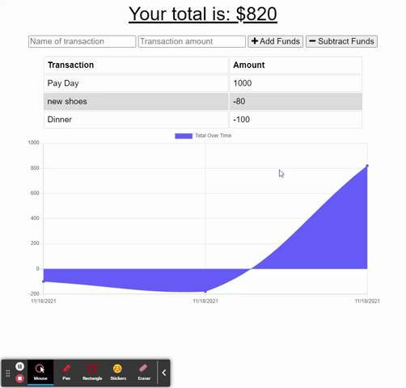

# PWA Budget Tracker

**This application is a budget tracker that is built using MongoDB, Node.JS, and Express. It is a Progressive Web Application which means it is setup to be installed for offline usage.**

## Built With

* [Javascript](https://www.javascript.com/)
* [Node.Js](https://nodejs.org/en/)
* [Express.Js](https://expressjs.com/)
* [MongoDB](https://www.mongodb.com/)
* [Mongoose](https://mongoosejs.com/docs/)
* [Morgan](https://www.npmjs.com/package/morgan)

## Instructions
Steps to install application:

1. Clone repository.
2. Run npm install
4. Run NPM Start to turn on your server
5. Server will be running locally on your machine
6. Alternative is to just visit the Heroku Deployed link to see the application.

* [Heroku Deployed Link](https://agile-brushlands-92284.herokuapp.com/)

## Author

* **DEREK BANISTER** 

- [Link to Portfolio Site](https://derek-banister-portfolio.herokuapp.com/)
- [Link to Github](https://github.com/DerekBanister)
- [Link to LinkedIn](https://www.linkedin.com/in/derek-banister/)